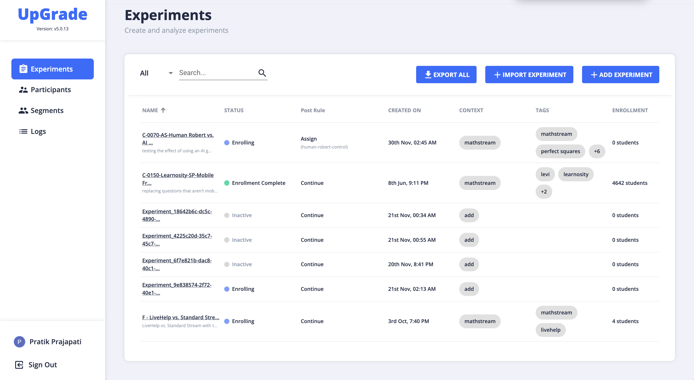
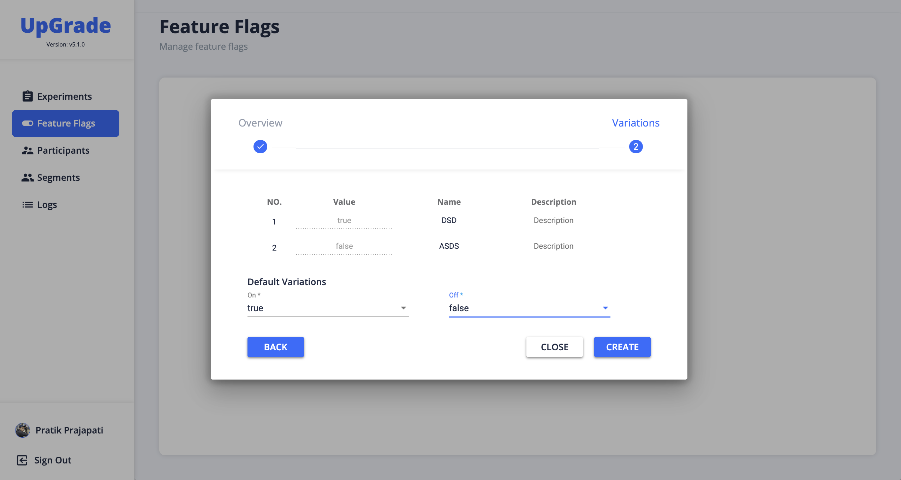

<p align="center"><a href="https://www.upgradeplatform.org"></a></p>
<p align="center"><b>Open Source A/B Testing & Feature Flagging Tool</b></p>

<div align="center">
    <a href="https://github.com/CarnegieLearningWeb/UpGrade/github/actions/workflows/backend-build.yml"></a>
    <a href="https://github.com/CarnegieLearningWeb/UpGrade/releases"></a>
    <a href="https://github.com/CarnegieLearningWeb/UpGrade"></a>
    <a href="https://github.com/CarnegieLearningWeb/UpGrade"></a>
    <a href="https://github.com/CarnegieLearningWeb/UpGrade/pulls"></a>
    <a href="https://github.com/CarnegieLearningWeb/UpGrade/issues"></a>
    <a href="https://github.com/CarnegieLearningWeb/UpGrade/graphs/contributors"></a>
    <a href="https://github.com/CarnegieLearningWeb/UpGrade/blob/dev/LICENSE"></a>
    <a href="https://join.slack.com/share/enQtNjI4MjA0NzQ1OTY3MS1mNTMwMmE3M2M4ZWUxYWI5NDAyYzBiNTBmY2ZjYTMyYmMzOTA4ODliZmI2MzBjNmQ5NTU0NmVlNzQ2OWNlOTgz"></a>
</div>

UpGrade is an open-source platform designed to support large-scale A/B testing in any web-application. This combined repository provides tools and resources to integrate A/B testing frameworks into various software solutions. Learn more at www.upgradeplatform.org.

## Features

- 🆎 **A/B Testing**: Implement controlled trials within software for impactful learning analysis.
- 🚩 **Feature Flagging**: Provision for experiment based feature flagging.
- 📊 **Segmentation**: Segmentation for inclusion/exclusion of groups.
- ➿ **Factorial Experiments**: Support for factorial experiment.
- ♊ **Stratified Random Sampling**: Provision for stratifications for categorical study.
- ⏫ **Scalability**: Designed to support large-scale experiments.
- 🔃 **Integration**: Easily integrates with various applications.
- 💻 **SDKs**: We have SDKs for [Java](https://github.com/CarnegieLearningWeb/UpGrade/tree/dev/clientlibs/java), [Javascript](https://github.com/CarnegieLearningWeb/UpGrade/tree/dev/clientlibs/js) and [C#](https://github.com/CarnegieLearningWeb/UpGrade/pull/860). More to come soon!

     &nbsp;&nbsp;  &nbsp;&nbsp; 

https://github.com/CarnegieLearningWeb/UpGrade/assets/33730817/86d72930-9fab-4949-a2ba-3e480a3cdf7e

## Documentation

Find detailed documentation for UpGrade at [UpGrade Documentation](https://upgrade-platform.gitbook.io/docs/).

## Quick Start (Using Docker)

#### 1. Get `Upgrade` running with a single command:

The included [docker-compose.yml](https://github.com/CarnegieLearningWeb/UpGrade/blob/dev/docker-compose.yml) file contains the Upgrade App and a Postgres instance (for storing experiment results and context metadata):

Clone the github repository and run the docker containers for DB and Upgrade App:

```sh
git clone https://github.com/CarnegieLearningWeb/UpGrade.git
cd Upgrade
docker-compose up -d
```

Then visit http://localhost:4200 and login using google id to view the Upgrade App.

<b>Dashboard</b>:

[](https://www.upgradeplatform.org)

<b>Feature Flagging</b>:

[](https://www.upgradeplatform.org)

##### 2. Get `Upgrade` running using Nix:

Get started with UpGrade using Docker with this [Quick Start Guide](https://upgrade-platform.gitbook.io/docs/developer-guide/usage-guide) using Nix for separate containers for frontend, backend and postgres DB as separate containers.


## How to Contribute

Contributions are always welcome! If you're interested in improving UpGrade, please create a PR to add your Github Profile in the contributors list. Please refer the [Contributors](https://github.com/CarnegieLearningWeb/UpGrade/blob/dev/contributors.md) file for the details of the trech stack we have used.

If you like this Repo, Please click the :star: !!!

## License

This project is licensed under the BSD-3-Clause License - see the [LICENSE](https://github.com/CarnegieLearningWeb/UpGrade/blob/main/LICENSE) file for details.

## Support

For support, please visit [UpGrade Platform](www.upgradeplatform.org).

## Acknowledgments

- Thanks to all the contributors who have helped build UpGrade.
- Special thanks to Carnegie Learning for supporting and growing this project.

#### Contributors:

<a href="https://github.com/VivekFitkariwala"></a> <a href="https://github.com/JD2455"></a> <a href="https://github.com/ppratikcr7"></a> <a href="https://github.com/danoswaltCL"></a> <a href="https://github.com/mfugate1"></a> <a href="https://github.com/PplJDHirapara"></a> <a href="https://github.com/RidhamShah"></a> <a href="https://github.com/msandbothe"></a> <a href="https://github.com/YashilDepani"></a> <a href="https://github.com/PplTanmayJain"></a> <a href="https://github.com/jerith666"></a> <a href="https://github.com/zackcl"></a>
<a href="https://github.com/Yagnik56"></a> <a href="https://github.com/jreddig"></a> <a href="https://github.com/nirmalpatel"></a> <a href="https://github.com/kawcl"></a> <a href="https://github.com/dhavalocked"></a> <a href="https://github.com/tanmayjain3"></a> <a href="https://github.com/amurphy-cl"></a> <a href="https://github.com/mhglover"></a> <a href="https://github.com/bcb37"></a> <a href="https://github.com/ldunne-cl"></a> <a href="https://github.com/mswartzCL"></a> <a href="https://github.com/telfekycl"></a>
---

For more information, please refer to the [official repository](https://github.com/CarnegieLearningWeb/UpGrade) of UpGrade.

---


